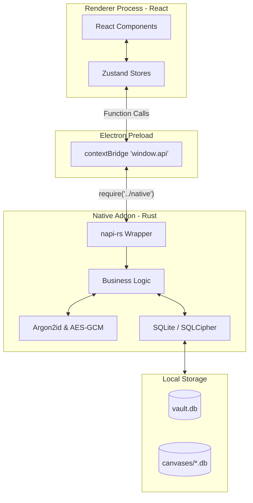
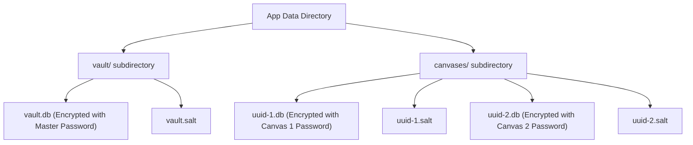
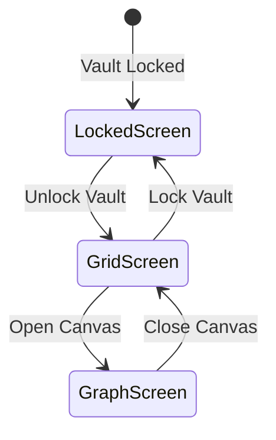

# Lattice Architecture

This document describes the technical architecture of Lattice, specifically focusing on the Electron/Rust (`napi-rs`) multi-canvas implementation.

## 1. High-Level System Diagram

Lattice uses a three-tier architecture that runs entirely locally, with no cloud backend.

- **Frontend**: A React application managing UI and state.
- **Electron Preload**: `electron/preload.js` exposes native functions to the frontend.
- **Native Addon**: Rust code compiled via [napi-rs](GLOSSARY.md) that is directly executed in the renderer process.*

*(Note: The Rust source directory is named `src-tauri` for historical reasons; it predates the Electron migration and was never renamed, despite the app no longer using Tauri.)*

## 2. Vault/Canvas Two-Tier Storage Model

Lattice uses a two-tier storage model. The primary driver for this architecture is that **SQLCipher encrypts at the whole-file level**, not the row level. To allow users to genuinely protect different canvases with different passwords, each canvas must be its own independent SQLite file.

**Implementation Details:**
- `src-tauri/src/paths.rs`: Constructs the paths for `vault_db`, `vault_salt`, and the `canvases/` directory.
- `src-tauri/src/state.rs`: The `AppState` struct cleanly separates this two-tier model:
  - `vault_db: Option<rusqlite::Connection>`
  - `vault_key: Option<Zeroizing<[u8; 32]>>`
  - `active_canvas: Option<ActiveCanvas>` (where `ActiveCanvas` holds the `id`, `db`, and `key` for the currently open canvas). Only one canvas is open at a time.

## 3. Traced Request Flows

### Flow A: Dragging a Node (Canvas Update)
The graph canvas enforces a strict two-mode dragging behavior based on `isEditMode`:
1. **React Component (View Mode)**: When the user drags a node in `frontend/src/components/graph/GraphCanvas.tsx` with edit mode disabled, React Flow handles the visual movement ephemerally. However, `onNodeDragStop` detects `!isEditMode` and returns early, preventing any state persistence.
2. **React Component (Edit Mode)**: If edit mode is enabled, `onNodeDragStop` fires and calls the `updateNodePositions` mutator in `graphStore.ts` to immediately update local state.
3. **API Wrapper**: `GraphCanvas.tsx` then calls `updateNodePosition(type, id, x, y)` defined in `frontend/src/api/nodes.ts` to persist the change.
4. **Preload Bridge**: `api/nodes.ts` calls `window.api.cmdUpdateNodePosition(...)`, mapped in `electron/preload.js`.
5. **napi-rs Native Addon**: The JavaScript call enters the Rust addon via the `#[napi]` macro function `cmd_update_node_position` in `src-tauri/src/commands/graph.rs`.
6. **Business Logic & SQLite**: The core Rust logic (`update_node_position_core`) locks the global `AppState`, extracts the `active_canvas`, and executes an `UPDATE` SQL statement against the SQLite database to save the new coordinates.

### Flow B: Unlocking a Canvas
1. **React Component**: The user clicks a canvas card in `CanvasGrid.tsx`, triggering an animation into an unlock modal. The user enters a password and submits.
2. **API Wrapper & Bridge**: The frontend calls `openCanvas(id, password)`, which bridges through `preload.js` to `cmd_open_canvas` in `src-tauri/src/commands/canvas.rs`.
3. **Serialization Gate**: Rust immediately acquires the `GLOBAL_UNLOCK_GATE` (a `tokio::sync::Mutex` in `state.rs`) to prevent concurrent crypto operations from thrashing the CPU.
4. **Argon2id Key Derivation**: The password and the canvas's specific salt (`canvases/<uuid>.salt`) are passed to `derive_master_key` in `src-tauri/src/crypto.rs` to generate a 32-byte key. This happens on a blocking background thread (`tokio::task::spawn_blocking`).
5. **SQLCipher Verification**: The key is converted to a hex string and fed to `PRAGMA key`. Rust attempts to read the `sqlite_schema` table. If it succeeds, the key is correct.
6. **State Update**: The database connection and the securely wrapped key (`Zeroizing<[u8; 32]>`) are stored in `AppState.active_canvas`.
7. **Frontend Update**: The frontend receives success, updates `authStore.ts`, and transitions to the graph view.

## 4. Encryption Model

Lattice uses a defense-in-depth cryptography strategy to protect the topology of the identity graph.

- **Argon2id**: Used to derive a 32-byte encryption key from the user's human-readable password.
- **SQLCipher**: Provides transparent 256-bit AES encryption of the *entire* database file. This ensures that the graph topology (which nodes exist and how they connect) is completely opaque at rest.
- **AES-256-GCM**: Used for **field-level encryption**. Even inside the SQLCipher database, highly sensitive fields like `password` and `notes` are encrypted again (see `encrypt_field` in `src-tauri/src/crypto.rs` and its usage in `src-tauri/src/commands/graph.rs`).
- **Zeroization**: Cryptographic keys in memory are wrapped in the `Zeroizing` type from the `zeroize` crate (e.g., `Zeroizing<[u8; 32]>` in `state.rs`). This ensures the memory is actively wiped with zeros when the variable goes out of scope, preventing keys from lingering in RAM.
- **What is NOT Encrypted**: Canvas names are stored in plaintext inside the unlocked `vault.db` registry. This is a deliberate design tradeoff to allow the grid view to render the names of available canvases without requiring the user to unlock every single canvas simultaneously.

## 5. Rate Limiting and Brute-Force Protection

Because Lattice is local-first, it must protect against local brute-force password guessing.
- The `AppState` struct in `src-tauri/src/state.rs` tracks `failed_attempts` and `last_attempt_at`.
- The `calculate_backoff_duration` function enforces a penalty: the first 3 attempts have no delay, but attempt 4 adds a 1-second delay, attempt 5 adds 2s, attempt 6 adds 4s, doubling up to a 30-second cap.
- This logic is invoked by `check_and_record_attempt` during any operation that verifies a password, ensuring the delay is enforced across both vault unlock (`auth.rs`) and canvas unlock/change password operations (`canvas.rs`).

## 6. Frontend State Architecture

The frontend avoids a monolithic state in favor of domain-specific Zustand stores:
- `authStore.ts`: Tracks overarching security status (is the vault locked? what is the `activeCanvasId`?).
- `canvasStore.ts`: Manages the grid view, sorting preferences, and layout transition targeting.
- `graphStore.ts`: Contains the heavy layout and interaction state for the open canvas (nodes, edges, selection, multi-select mode).

**Three-State Routing (`App.tsx`)**:
The application root routes the user between three primary states based on the stores:

1. **Locked**: Vault is locked. Renders `UnlockScreen.tsx`.
2. **Unlocked, No Canvas**: Vault is unlocked, but `activeCanvasId` is null. Renders the grid `CanvasGrid.tsx`.
3. **Unlocked, With Canvas**: `activeCanvasId` is populated. Renders the main `GraphCanvas.tsx` interface.

## 7. Multi-Canvas UI Flow

The multi-canvas selection interface relies heavily on Framer Motion's `layoutId` for spatial continuity.
1. The user views a grid of canvas cards (`CanvasGrid.tsx`).
2. Clicking a card updates local state to set an `unlockingCanvas`.
3. Framer Motion detects a component change with a matching `layoutId` (the card ID) and automatically animates the small card expanding into the large centered unlock modal.
4. Upon successful password entry, `App.tsx` routes the user to the graph view.

## 8. Build and Packaging Architecture

The build process is divided between the native Rust addon and the web frontend:
- **Rust Core**: Compiled via `npm run build:native`, which uses the `@napi-rs/cli` to generate a binary `.node` file from `src-tauri`.
- **Frontend**: Compiled via `npm run build:frontend` (Vite) into the `frontend/dist/` folder.
- **Electron Builder**: Packages the HTML/JS and the `.node` file into OS-specific installers (`.dmg`, `.exe`, `.AppImage`).

**CI/CD Pipeline (`.github/workflows/build.yml`)**:
- **Build Job**: Runs on every push. It uses a matrix (`ubuntu-latest`, `windows-latest`, `macos-latest`) to natively compile the Rust addon for each OS (avoiding cross-compilation complexities with C-dependencies like SQLCipher). It produces short-lived installer artifacts.
- **Release Job**: Runs *only* when a version tag (e.g., `v1.0.0`) is pushed. It downloads the artifacts from the Build Job and publishes them permanently to a GitHub Release.

## 9. Known Limitations (Deliberately Deferred)

Several architectural compromises were explicitly discussed and accepted as known limitations:

- **`sandbox: false` in Electron**: In `electron/main.js`, the renderer process sandbox is explicitly disabled. `sandbox: true` was investigated, and it was found that `preload.js`'s `require('../native')` would **crash the app outright** under a sandboxed renderer, because sandboxed preloads cannot `require()` arbitrary native addons. It was deferred because fixing it properly requires a major architectural refactor (moving all native-addon calls into the Electron main process and bridging them asynchronously behind `ipcMain.handle` / `ipcRenderer.invoke`).
- **Electron Version CVE Gap**: The project currently uses Electron `^30.5.1`. An upgrade to version `38+` to address a specific upstream CVE (CVE-2026-34776) was recognized but explicitly deferred because it would require a significant dependency rebuild and verification effort for an application that only loads local files.
- **Frontend `any`-Typing Debt**: Several areas of the frontend (notably in `EdgeForm.tsx` where discriminated union `GraphNode` types are cast to `any`) bypass the TypeScript compiler. This was identified as technical debt that defeats the type system but was deferred as it functions correctly in the current UI flow.
