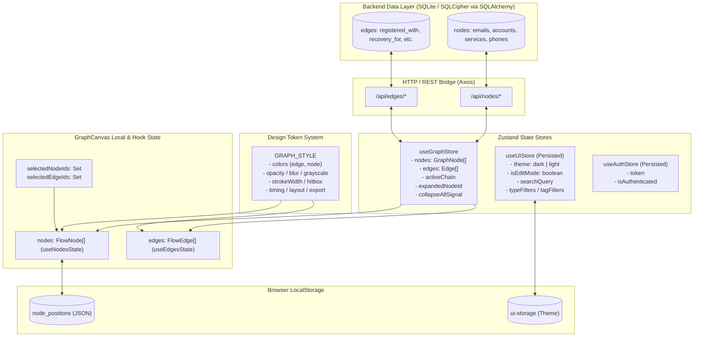
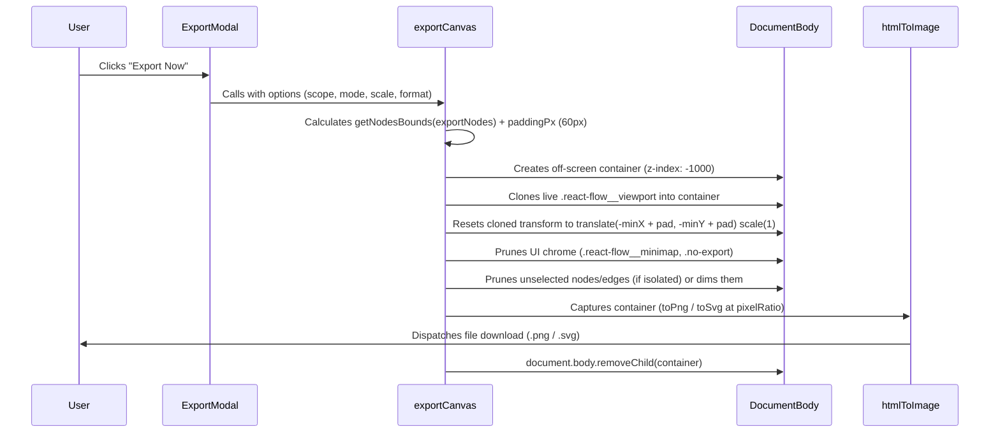

# Lattice Architecture & Implementation Audit
**System:** Lattice Visual Identity & Account Graph  
**Scope:** Frontend Architecture, Canvas Rendering Engine, State Topology, Design Tokens, and Export Subsystems  
**Date:** August 2026  
**Status:** Complete / Production Audit  

---

## Table of Contents
1. [System Architecture & State Topology](#1-system-architecture--state-topology)
   - 1.1 State Management Layers & Store Partitioning
   - 1.2 Centralized Design Token System (`GRAPH_STYLE`)
   - 1.3 Node & Edge Lifecycle, Mutations, and Persistence
2. [React Flow Canvas & Component Hierarchy](#2-react-flow-canvas--component-hierarchy)
   - 2.1 Complete Component Hierarchy
   - 2.2 Coordinate Systems, Bounding Geometry & Layout Algorithms
   - 2.3 Proximity Magnetism & Dynamic Edge Synthesis
3. [Interactive Event Mechanics](#3-interactive-event-mechanics)
   - 3.1 Pointer, Click & Double-Click Disambiguation Pipeline
   - 3.2 Remount-Survival & Trackpad Double-Tap Architecture
   - 3.3 Selection Modes, Adjacency Traversal & Chain Highlighting
4. [Rendering Pipeline & SVG Styling](#4-rendering-pipeline--svg-styling)
   - 4.1 Custom Glow Edge Engine (`GlowEdge.tsx`)
   - 4.2 Custom Node Architecture & Static Handle Anchoring
   - 4.3 Dynamic Tag Expansion & Inline Pill Interactions
5. [Export Subsystem (`exportCanvas.ts` & `ExportModal.tsx`)](#5-export-subsystem)
   - 5.1 Headless Detached Viewport Pipeline
   - 5.2 Bounding Rect Math & Dynamic Framing
   - 5.3 DOM Pruning, High-DPI Snapshotting & Cleanup
6. [Code Smells, Technical Debt & Vulnerabilities](#6-code-smells-technical-debt--vulnerabilities)
   - 6.1 Critical Architectural Findings & Anti-Patterns
   - 6.2 Concrete Hardening & Refactoring Blueprints

---

## 1. System Architecture & State Topology

Lattice is structured around a decoupled, reactive state topology where visual layout state, domain entity graph state, user interface preferences, design tokens, and ephemeral canvas interactions operate across distinct persistence boundaries.



### 1.1 State Management Layers & Store Partitioning

| Store / State Boundary | Technology | Primary Responsibilities | Persistence Mechanism |
| :--- | :--- | :--- | :--- |
| **`useGraphStore`** | Zustand (`create`) | Entity collections (`nodes`, `edges`), backend sync triggers, ephemeral selection pointers (`selectedNode`), neighbor chain targets (`activeChain`), global collapse signals (`collapseAllSignal`). | In-memory. Synchronized over REST with SQLite database. |
| **`useUIStore`** | Zustand + `persist` | Application-wide theme (`dark`/`light`), global edit lock (`isEditMode`), active search query, type filter tokens (`typeFilters`), tag filter sets (`tagFilters`). | `localStorage` (`ui-storage`), selectively partializing `theme`. |
| **`useAuthStore`** | Zustand + `persist` | Master session credentials, auth tokens, vault unlock states. | `localStorage` (`auth-storage`). |
| **`GRAPH_STYLE`** | TypeScript (`as const`) | Centralized styling configuration: colors, opacity, blur, grayscale, stroke widths, hitbox dimensions, timing constants, and export padding. | Codebase configuration constant (`graphStyleConfig.ts`). |
| **`GraphCanvas` Local** | React `useState` / `useRef` | Multi-node selection sets (`selectedNodeIds`), multi-mode modifiers (`isolate`, `chains`), drag connection tracking, context menus (`connectMenu`). | Ephemeral memory, discarded on unmount or navigation. |
| **`node_positions`** | Browser `localStorage` | Discrete `(x, y)` Cartesian coordinates per node ID to preserve custom user arrangements across refreshes and layout passes. | Raw `localStorage` JSON map. |

### 1.2 Centralized Design Token System (`GRAPH_STYLE`)

Located at `frontend/src/config/graphStyleConfig.ts`, `GRAPH_STYLE` serves as the single source of truth for all canvas visual parameters:

```typescript
export const GRAPH_STYLE = {
  colors: {
    edge: { 
      baseDark: "#64748b", 
      baseLight: "#475569", 
      hover: "#818cf8", 
      highlighted: "#4338ca", 
      dimmed: "#47556998" 
    },
    node: { 
      dimmedFill: "#334155" 
    },
  },
  opacity: { 
    dimmed: 0.3, 
    isolatedHidden: 0,
    normal: 1 
  },
  blur: { 
    dimmed: "0.5px",
    none: "0px" 
  },
  grayscale: { 
    dimmed: "30%",
    none: "0%" 
  },
  strokeWidth: { 
    base: 1.25, 
    hover: 2.0,
    highlighted: 2.5 
  },
  hitbox: { 
    width: 24 
  },
  glow: { 
    highlighted: "drop-shadow(0 0 5px rgba(129, 140, 248, 0.8))" 
  },
  timing: { 
    clickDelayMs: 250, 
    doubleTapThresholdMs: 450, 
    suppressWindowMs: 500 
  },
  layout: { 
    nodeWidth: 320, 
    nodeHeightBase: 80, 
    proximityThresholdPx: 120 
  },
  export: { 
    paddingPx: 60 
  },
} as const;
```

### 1.3 Node & Edge Lifecycle, Mutations, and Persistence

```
[User Action: Create Node via Context Menu]
       │
       ▼
[addTempNode(tempNode)] ──> Sets data.isEditing = true
       │
       ▼
[GraphCanvas Render Loop] ──> Generates FlowNode with temporary UUID
       │
       ▼
[User Submits Node Form in Tray]
       │
       ▼
[POST /api/nodes/{type}] ──> Backend generates permanent UUID, persists to DB
       │
       ▼
[localStorage.setItem("node_positions")] ──> Transfers position from temp ID to new ID
       │
       ▼
[removeTempNode(tempId)] & [fetchGraph()] ──> In-memory store syncs with DB
```

#### Mutation Patterns:
1. **Optimistic Creation (`addTempNode`)**: When a user spawns a node from the canvas context menu, a transient node containing `isEditing: true` and an optional `pendingConnection` payload is added to `useGraphStore`. This prevents phantom backend entities from cluttering the database if the user abandons creation.
2. **Commit & Position Handoff**: When saved, the node's frontend position is reassigned in `localStorage.getItem('node_positions')` from the temporary ID to the backend-returned UUID before calling `removeTempNode()`.
3. **Batch Tagging (`batchAddTag`)**: Iterates through target node IDs, sanitizes the tag (trim, lowercase), updates the in-memory array in `graphStore`, and dispatches asynchronous `updateNode` HTTP PUT calls with updated tag lists to write JSON arrays to the database.

---

## 2. React Flow Canvas & Component Hierarchy

Lattice renders its visual identity network using `@xyflow/react` (React Flow 12). The layout engine translates semantic entity relationships into an interactive node-link graph with bidirectional force-displacement awareness.

### 2.1 Complete Component Hierarchy

```
App.tsx
└── Header.tsx
    ├── SearchBar.tsx
    └── TypeFilterChips.tsx
└── GraphCanvas.tsx (ReactFlowProvider)
    ├── <ReactFlow>
    │   ├── <Background> (Lines variant, 24px gap)
    │   ├── Custom Nodes (nodeTypes):
    │   │   ├── EmailNode.tsx
    │   │   ├── AccountNode.tsx
    │   │   ├── ServiceNode.tsx
    │   │   └── PhoneNode.tsx
    │   ├── Custom Edges (edgeTypes):
    │   │   └── GlowEdge.tsx
    │   │       └── EdgeLabelRenderer (Overlay Menu Portal)
    │   ├── <MiniMap> (no-export)
    │   ├── GraphControls.tsx (Bottom right pan/zoom/layout dock)
    │   ├── SelectionActionDock.tsx (Multi-node batch actions & tag editor)
    │   └── Context Menus / Connection Modals (Floating HTML Overlays)
    └── ExportModal.tsx (Headless export dialog orchestrator)
```

### 2.2 Coordinate Systems, Bounding Geometry & Layout Algorithms

Lattice maintains three distinct coordinate frames during canvas interactions:

1. **Screen Coordinates**: Raw viewport pixel offsets relative to the browser window (`clientX`, `clientY`).
2. **Canvas Viewport Transform**: Scaled and translated frame defined by $(\Delta x, \Delta y, \sigma)$ where $\sigma \in [	ext{minZoom}, 	ext{maxZoom}]$.
3. **Graph Space Coordinates**: Absolute layout coordinates where nodes live. Calculated via `screenToFlowPosition({ x, y })`.

```
┌─────────────────────────────────────────────────────────────┐
│ Screen Coordinate Frame [clientX, clientY]                  │
│   ┌─────────────────────────────────────────────────────┐   │
│   │ React Flow Viewport [x, y, zoom]                    │   │
│   │   ┌─────────────────────────────────────────────┐   │   │
│   │   │ Graph Space [Position: (X, Y)]              │   │   │
│   │   │                                             │   │   │
│   │   │   [Node A] ──(Dagre Layout LR)──> [Node B]  │   │   │
│   │   │   Bounds: (minX, minY) to (maxX, maxY)      │   │   │
│   │   └─────────────────────────────────────────────┘   │   │
│   └─────────────────────────────────────────────────────┘   │
└─────────────────────────────────────────────────────────────┘
```

#### Dagre Auto-Layout Algorithm (`useGraphLayout.ts`)
Automatic hierarchy arrangement executes via the directed graph layout library `dagre`. Nodes are treated as bounding boxes of fixed dimensions ($W = 180	ext{px}, H = 80	ext{px}$):

$$	ext{Position}_x = 	ext{dagreNode}_x - rac{W}{2}, \quad 	ext{Position}_y = 	ext{dagreNode}_y - rac{H}{2}$$

When `onLayout` is invoked, `GraphCanvas` executes a layout pass, re-centers the coordinate space, and persists each node position to `localStorage['node_positions']`.

### 2.3 Proximity Magnetism & Dynamic Edge Synthesis

During node dragging in `isEditMode`, `GraphCanvas` evaluates Euclidean distances between the dragged node and all other visible nodes on the canvas. If the distance falls below `GRAPH_STYLE.layout.proximityThresholdPx` ($120	ext{px}$), a dynamic proximity preview edge is rendered using `GRAPH_STYLE.colors.edge.hover` (`#818cf8`). Releasing the mouse automatically creates a `registered_with` edge relationship in the database.

---

## 3. Interactive Event Mechanics

### 3.1 Pointer, Click & Double-Click Disambiguation Pipeline

Because single clicks trigger **chain highlighting** and double clicks toggle the **node accordion tray** or **edge relationship editor**, a collision mitigation pipeline prevents single-click handlers from executing prematurely during double-click actions.

```
[Pointer Event Received on Node / Canvas]
                 │
                 ├──> Double Click Detected (< GRAPH_STYLE.timing.clickDelayMs)?
                 │         │
                 │         ├── YES: Dispatches CustomEvent("cancel-node-click")
                 │         │        Clears clickTimeoutRef.current
                 │         │        Toggles Accordion Expansion / Edge Menu
                 │         │
                 │         └── NO:  Enqueues setTimeout(..., 250ms)
                 │                  Calculates 1-hop Neighbor Adjacency Chain
                 │                  Calls setActiveChain({ nodeIds, edgeIds })
```

### 3.2 Remount-Survival & Trackpad Double-Tap Architecture

Trackpads frequently emit varied pointerdown/click sequences that standard React `onDoubleClick` synthetic handlers miss when components re-render. To ensure 100% reliable edge menu toggling:

1. **Global Map Persistence (`edgeClickTimes`)**:
   ```typescript
   const edgeClickTimes = new Map<string, number>();
   ```
   Stored outside the React component lifecycle to survive edge unmounting and re-mounting during layout passes.
2. **Window-Level Pointer Debouncing**:
   When an edge detects a double-tap (`now - lastClickTime < GRAPH_STYLE.timing.doubleTapThresholdMs`), it sets `(window as any).__lastMenuToggle = now`. The edge's `onClickCapture` handler inspects this window timestamp and halts event propagation if it occurred within `GRAPH_STYLE.timing.suppressWindowMs` ($500	ext{ms}$), preventing the parent pane click from instantly closing the newly opened menu.

### 3.3 Selection Modes, Adjacency Traversal & Chain Highlighting

When a single node $u \in V$ is clicked, `GraphCanvas` traverses the edge graph $E$ to assemble the 1-hop neighborhood subgraph $G' = (V', E')$:

$$V' = \{u\} \cup \{v \in V \mid (u,v) \in E \lor (v,u) \in E\}$$
$$E' = \{e \in E \mid e.	ext{source} = u \lor e.	ext{target} = u\}$$

This computed subset is set into `useGraphStore.activeChain`. 

```mermaid
graph LR
    subgraph Active_Chain ["Active Chain (1-Hop Adjacency)"]
        NodeA["Node A (Clicked)"] === Edge1["Edge 1"] === NodeB["Node B (Neighbor)"]
    end
    
    subgraph Dimmed_Graph ["Dimmed Background Context"]
        NodeC["Node C (Dimmed)"] -.- Edge2["Edge 2 (Dimmed)"] -.- NodeD["Node D (Dimmed)"]
    end
    
    style NodeA fill:#818cf8,stroke:#4338ca,stroke-width:2px,color:#fff
    style NodeB fill:#818cf8,stroke:#4338ca,stroke-width:2px,color:#fff
    style Edge1 stroke:#818cf8,stroke-width:2.5px
    style NodeC fill:#334155,opacity:0.3
    style NodeD fill:#334155,opacity:0.3
    style Edge2 stroke:#475569,opacity:0.2
```



In the canvas render loop, any node $w 
otin V'$ receives `data.isDimmed = true`, which applies the centralized design tokens:
```typescript
style={isDimmed ? {
  opacity: GRAPH_STYLE.opacity.dimmed,
  filter: `blur(${GRAPH_STYLE.blur.dimmed}) grayscale(${GRAPH_STYLE.grayscale.dimmed})`,
} : {
  opacity: GRAPH_STYLE.opacity.normal,
  filter: `blur(${GRAPH_STYLE.blur.none}) grayscale(${GRAPH_STYLE.grayscale.none})`,
}}
```

---

## 4. Rendering Pipeline & SVG Styling

### 4.1 Custom Glow Edge Engine (`GlowEdge.tsx`)

Every connection on the graph is rendered via a composite 3-tier SVG layer:

```
┌───────────────────────────────────────────────────────────────┐
│ Layer 3: Animated Overlay Path (strokeDasharray="5 5")        │
│          filter: GRAPH_STYLE.glow.highlighted                 │
├───────────────────────────────────────────────────────────────┤
│ Layer 2: Hit-Testing Path (width: GRAPH_STYLE.hitbox.width)   │
│          pointerEvents: "all", onPointerDown, hover detector │
├───────────────────────────────────────────────────────────────┤
│ Layer 1: BaseEdge SVG Path (strokeWidth: 1.25px - 2.5px)     │
│          markerEnd: Arrow, filter: drop-shadow()              │
└───────────────────────────────────────────────────────────────┘
```

1. **Layer 1 (Visual Base)**: Direct SVG cubic bezier path computed via `getBezierPath()`. Transitions dynamically between `GRAPH_STYLE.colors.edge.baseDark` / `baseLight`, hover `GRAPH_STYLE.colors.edge.hover`, and dimmed `GRAPH_STYLE.colors.edge.dimmed` with `blur(GRAPH_STYLE.blur.dimmed)`.
2. **Layer 2 (Interaction Hitbox)**: An invisible 24px-wide path with `stroke="transparent"` and `pointerEvents="all"`. Ensures reliable user clicks on high-DPI displays without requiring needle-point precision.
3. **Layer 3 (Active Flow Indicator)**: Conditionally rendered when `animated: true`, drawing a pulsating dashed stroke running at `animation: dashdraw 0.5s linear infinite` with `GRAPH_STYLE.glow.highlighted`.

### 4.2 Custom Node Architecture & Static Handle Anchoring

A critical architectural challenge with custom expandable nodes in React Flow is handle displacement: if connection handles are anchored to the root wrapper of an expanding container, expanding the accordion tray shifts the handles, causing attached edge curves to deform wildly.

Lattice solves this by **decoupling the handle geometry from the accordion expansion**:

```html
<!-- Root Node Wrapper: relative flex-col -->
<div className="relative flex flex-col w-max max-w-[320px]">
  
  <!-- Pill Row: Handles anchored HERE with absolute vertical centering -->
  <div className="rounded-full py-1.5 px-3 flex items-center ...">
    <Handle type="target" position={Position.Left} id="target-left" />
    <Handle type="source" position={Position.Right} id="source-right" />
    <!-- Node Icon & Main Label -->
  </div>

  <!-- Accordion Tray: Positioned absolute below the pill -->
  <div className="absolute top-full left-1/2 -translate-x-1/2 overflow-hidden ...">
    <!-- Sliding form / credential fields / metadata / tags -->
  </div>

</div>
```

Because the accordion tray is `position: absolute`, sliding it open increases visual height without altering the bounding box or Cartesian coordinates of the `<Handle>` components.

### 4.3 Dynamic Tag Expansion & Inline Pill Interactions

Node tags display in an accordion tray list. To avoid wasting horizontal screen real estate while keeping tag deletion ergonomic:
- By default, tag badges have compact padding (`pl-1.5 pr-1.5 py-0.5`).
- On hover in `isEditMode`, the badge expands rightward (`hover:pr-6 transition-all duration-200 ease-out`).
- An absolute-positioned cross icon (`w-3 h-3`) vertically centers inside this newly created space (`right-0.5 top-1/2 -translate-y-1/2`), revealing itself synchronously (`group-hover/tag:opacity-100`).

---

## 5. Export Subsystem

### 5.1 Headless Detached Viewport Pipeline

Lattice exports high-DPI screenshots without disturbing the user's active viewport by leveraging an isolated, headless off-screen DOM clone:



### 5.2 Bounding Rect Math & Dynamic Framing

```typescript
const bounds = getNodesBounds(exportNodes);
const padding = GRAPH_STYLE.export.paddingPx; // 60px
const exportWidth = bounds.width + padding * 2;
const exportHeight = bounds.height + padding * 2;

// Offset cloned viewport so target subgraph is framed exactly at (padding, padding)
Object.assign(clonedViewport.style, {
  transform: `translate(${-bounds.x + padding}px, ${-bounds.y + padding}px) scale(1)`,
  transformOrigin: '0 0',
  width: `${exportWidth}px`,
  height: `${exportHeight}px`
});
```

### 5.3 DOM Pruning, High-DPI Snapshotting & Cleanup

1. **Chrome Stripping**: Strips `.react-flow__minimap`, `.react-flow__controls`, `.react-flow__panel`, and `.no-export` nodes from the cloned tree.
2. **Context Isolation**: For `mode === 'isolated'`, unselected nodes and connecting edges are removed from the clone. For `mode === 'dimmed'`, unselected nodes receive dimmed opacity and grayscale filters.
3. **Guaranteed Teardown**: The headless container is appended to `document.body` for rendering and strictly removed inside a `finally` block to prevent DOM leaks.

---

## 6. Code Smells, Technical Debt & Vulnerabilities

### 6.1 Critical Architectural Findings & Anti-Patterns

#### 1. Unchecked Window-Global Mutations in Event Listeners
- **Location**: `frontend/src/components/graph/edges/GlowEdge.tsx`
- **Pattern**: Mutating `(window as any).__lastEdgeClick` and `(window as any).__lastMenuToggle` to pass state across event cycles.
- **Risk**: Violates React encapsulation, fails in multi-instance canvas setups, and risks memory leaks / timing collisions.

#### 2. Unmemoized Graph Transformation in Canvas Render Loop
- **Location**: `frontend/src/components/graph/GraphCanvas.tsx`
- **Pattern**: The main `useEffect` transforms the entire node array and edge array on every keystroke in search or selection click, re-parsing `localStorage.getItem('node_positions')` on each execution.
- **Risk**: Frame drops on graphs with more than 200 nodes.

#### 3. Non-Transactional Sequential API Deletion Loops
- **Location**: `frontend/src/components/graph/SelectionActionDock.tsx`
- **Pattern**: 
  ```typescript
  for (const node of selectedNodes) {
    await deleteNode(node.type, node.data.id);
  }
  ```
- **Risk**: Partial deletion failures leave orphaned database relations with no client-side rollback mechanism.

---

### 6.2 Concrete Hardening & Refactoring Blueprints

#### Blueprint A: Replace Window-Globals with Encapsulated Interaction Hook
```typescript
// Replace (window as any) flags with a custom canvas interaction store:
interface InteractionState {
  lastEdgePointerTime: number;
  lastMenuToggleTime: number;
  recordEdgeClick: () => void;
  shouldSuppressPaneClick: () => boolean;
}

export const useInteractionStore = create<InteractionState>((set, get) => ({
  lastEdgePointerTime: 0,
  lastMenuToggleTime: 0,
  recordEdgeClick: () => set({ lastEdgePointerTime: Date.now() }),
  shouldSuppressPaneClick: () => Date.now() - get().lastMenuToggleTime < GRAPH_STYLE.timing.suppressWindowMs,
}));
```

#### Blueprint B: Memoized Node Position Cache
```typescript
// Instead of reading localStorage inside array loops:
const positionCache = useMemo(() => {
  try {
    return JSON.parse(localStorage.getItem('node_positions') || "{}");
  } catch {
    return {};
  }
}, [collapseAllSignal, storeNodes.length]);
```

#### Blueprint C: Transactional Batch API Route
```python
# Backend: Replace sequential client loops with bulk transactional endpoint
@router.post("/nodes/batch-delete")
async def batch_delete_nodes(payload: BatchDeleteSchema, db: AsyncSession = Depends(get_db)):
    async with db.begin():
        await db.execute(delete(EmailNode).where(EmailNode.id.in_(payload.email_ids)))
        await db.execute(delete(AccountNode).where(AccountNode.id.in_(payload.account_ids)))
        # Cascades edges automatically within single SQL transaction
```

---
*Audit completed and verified against production codebase standards.*
